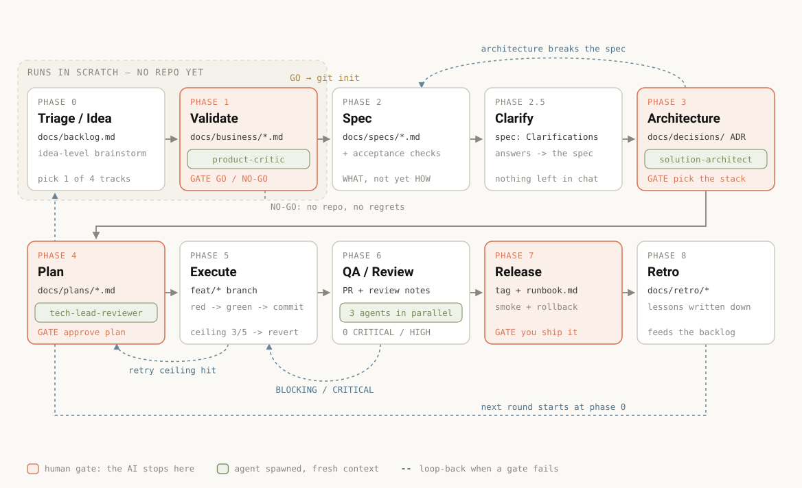

# solo-sdlc

A gated 9-phase SDLC for **one founder shipping with AI**.

Most AI coding workflows optimize the wrong bottleneck. When you're solo, the expensive failure isn't slow typing — it's spending three weeks building something nobody wanted, or letting an agent grind on a broken plan until it has wrecked your codebase. This plugin puts gates where those failures happen.

Three ideas do most of the work:

- **Validate the business case before the repo exists.** A repo is the artifact of deciding to *build*, not of deciding *whether* to build. Phases 0–1 run in a scratch directory; `git init` happens only after you say GO.
- **The author never grades their own work.** Every review is a separate agent with fresh context — the session that wrote the plan cannot be the one that approves it.
- **Execution has a ceiling.** An agent gets 3 attempts at the same failure and 5 at a task. Then it reverts to the last green commit and reports, instead of looping until your budget and your architecture are both gone.

## Install

**Claude Code**

```
/plugin marketplace add ltlongtma/solo-sdlc
/plugin install solo-sdlc@solo-sdlc
```

**Any other agent, via [APM](https://github.com/microsoft/apm)** — Copilot, Cursor, Codex, Gemini, OpenCode, Windsurf, Kiro:

```
apm install ltlongtma/solo-sdlc
```

APM writes each primitive to the directory your harness actually reads: skills to `.agents/skills/` (the location Copilot, Cursor, Codex, Gemini, OpenCode and Windsurf share) or to `.claude/skills/` and `.kiro/skills/` for the two that differ, and agents to the harness-specific agents directory. `apm.lock.yaml` pins the version.

**VS Code / GitHub Copilot, without APM** — the plugin format is shared, and VS Code looks for `.claude-plugin/plugin.json`, so this repo installs as-is. Run **Chat: Install Plugin From Source** from the Command Palette and paste the repo URL (requires `chat.plugins.enabled`).

**By hand** — Cursor and VS Code both read `~/.claude/`, so symlinking works too:

```
git clone https://github.com/ltlongtma/solo-sdlc
ln -s "$PWD/solo-sdlc/skills/sdlc" ~/.claude/skills/sdlc
ln -s "$PWD"/solo-sdlc/agents/*.md ~/.claude/agents/
```

Verified with `apm install --target cursor`: all 11 primitives land, the skill at `.agents/skills/sdlc/`, the five agents at `.cursor/agents/`, the five commands at `.cursor/commands/`. What I have *not* verified is whether each harness then surfaces those commands in its own `/` menu, or whether `qa-breaker`'s `model: sonnet` is honored outside Claude Code — worst case it runs on your session model, which is harmless. The skill auto-triggers either way.

## Use it

```
/solo-sdlc:find-idea  <nothing, or a vague idea>        # phase 0 — mine the web, shortlist 2-3 ideas
/solo-sdlc:start      I want to build a tool that ...   # full pipeline, from anywhere
/solo-sdlc:validate   <a rough idea>                    # phase 1 only — is this worth building?
/solo-sdlc:architect                                    # phase 3 only — stack options + trade-offs
/solo-sdlc:gate                                          # phase 6 only — the QA/review gate
/solo-sdlc:converge                                      # reconcile real code against spec + plan
```

The `sdlc` skill also auto-triggers on things like *"take this idea to production"* or *"resume this project properly"*. A vague idea is a fine starting point — phase 0 exists to sharpen it. **No idea at all is also a fine starting point**: `find-idea` mines complaints, reviews, job ads and market shifts for a pain somebody already pays to escape, and hands you a shortlist instead of a guess.

## The pipeline

<picture>
  <source media="(prefers-color-scheme: dark)" srcset="docs/pipeline-dark.svg">
  
</picture>

<sub>Phase 6 spawns three agents in parallel: `tech-lead-reviewer`, `qa-breaker`, and `security-reviewer` (the last one only when the diff touches sensitive ground). Regenerate the diagram with `python3 docs/generate-pipeline-svg.py`.</sub>

| # | Phase | Artifact | Gate |
|---|---|---|---|
| 0 | Triage / Idea | `docs/backlog.md` (+ an idea scan, if you started with nothing) | Worth doing? which track? |
| 1 | Validate | `docs/business/<idea>-validation.md` | **GO / NO-GO ⛔** |
| 2 | Spec | `docs/specs/<feature>.md` + acceptance checklist | Spec agreed |
| 2.5 | Clarify | Clarifications section in the spec | Nothing ambiguous blocks the plan |
| 3 | Architecture | ADRs + `docs/design/architecture.html` | **Stack chosen ⛔** |
| 4 | Plan | `docs/plans/YYYY-MM-DD-*.md` + verified research + task status | **Plan approved ⛔** |
| 5 | Execute | code on `feat/*`, one commit per task | Every task green |
| 6 | QA / Review | PR + review notes | CI green, checklist passes, no CRITICAL/HIGH |
| 7 | Release | tag + `docs/releases/*` + `docs/runbook.md` | **Human ships ⛔** |
| 8 | Retro | `docs/retro/*` | Lessons written down |

Phases scale to the work through four rigor tracks: **trivial** (skip 1–4), **feature** (skip validate), **high-risk** (architecture + security required, two review rounds), **new product** (all nine).

There's an interactive version of this diagram in [`docs/workflow-diagram.html`](docs/workflow-diagram.html) — open it locally to click through each phase and highlight the path a given track takes.

## The agents

| Agent | Runs at | Mandate |
|---|---|---|
| `product-critic` | phase 1 | Kill bad ideas cheaply. Market, competitors, unit economics, distribution, risk. Every claim cited; every fatal assumption gets the cheapest possible test. |
| `solution-architect` | phase 3 | Propose 2–3 stacks with real monthly costs and escape routes. Optimizes for *"can one person fix this at 2am?"* Proposes — never approves. |
| `tech-lead-reviewer` | phases 4 & 6 | Assume the document is broken and find out how. Dependency order, interface drift, oversized tasks, requirement→task coverage matrix. |
| `qa-breaker` | phase 6 | Break it before a user does. Edge cases, boundaries, replay, cross-account access, error paths. A bug without a repro doesn't count. |
| `security-reviewer` | phase 6, conditional | Attacker's lens: secrets, IDOR, injection, SSRF, webhook replay, dependency CVEs. CRITICAL/HIGH block the merge. |

All of them report and never edit — fixing belongs to the main session.

## Tuning models and effort

The plugin is deliberately almost neutral here, and the defaults are worth understanding before you change them.

**Models.** Four agents ship as `model: inherit`, so they run on whatever you chose for the session — which is normally the strongest model you have. `qa-breaker` ships as `model: sonnet`: it spends most of its turns running the suite, trying inputs, and tabulating results, and it's the agent you run most often, so it's the one place a cheaper model pays for itself. Nothing is pinned to a full model ID (`claude-opus-5`) — only aliases, so the plugin doesn't rot when a new model lands.

**Effort.** No agent sets `effort`, on purpose. [The default is already `high`](https://docs.claude.com/en/docs/claude-code/model-config#adjust-effort-level) on every model that supports effort, so writing `effort: high` into these files would change nothing. And frontmatter effort *overrides your session level* — pinning `xhigh` here would silently spend more than someone who deliberately ran `/effort medium` asked for. `max` also carries a documented risk of overthinking.

If you do want to tune it, this is where each dial lives:

| What you want | How |
| --- | --- |
| A different model for one agent | Edit `model:` in `agents/<name>.md` — alias (`opus`, `sonnet`, `haiku`, `fable`), a full model ID, or `inherit` |
| A different model for *all* subagents | `CLAUDE_CODE_SUBAGENT_MODEL` — takes precedence over every agent file |
| The single biggest saving | `CLAUDE_CODE_SUBAGENT_MODEL=sonnet` before phase 5. Execution subagents are spawned by your SDD skill, not by this plugin, so no agent file reaches them — and once tasks satisfy the granularity rules (one test, one commit, 1–3 files) the extra capability buys very little |
| Cheaper idea scans | Nothing to configure — `find-idea` already tells its scouts to run on a cheap tier where the harness allows it, and keeps clustering and scoring on the session model |
| Deeper reasoning on the merge-blocking reviewers | Add `effort: xhigh` to `agents/tech-lead-reviewer.md` and `agents/security-reviewer.md`. Defensible: a missed BLOCKING finding costs more than the tokens |
| Cheaper QA passes | `model: haiku` on `qa-breaker`, or add `effort: medium` |
| One phase deeper than the rest | Set it on your session with `/effort` before that phase — a skill spanning nine phases can't carry one useful effort value |
| Cap it globally | `CLAUDE_CODE_EFFORT_LEVEL` — takes precedence over frontmatter and the session |

Rough guide to which phases actually reward depth: **1, 3, and 4** (validation, architecture, plan review) are judgment-heavy and where a bad call is expensive to unwind. **0** is split — the scouts that go and read the internet are mechanical, while clustering what they bring back and scoring it is not. **5** (execute) is mostly mechanical once the plan is good — that's the point of the task-granularity rules. **6** is judgment-heavy again, which is why its reviewers inherit rather than downgrade.

## Design decisions worth knowing about

**Required sections are slots, not reminders.** `scaffold.sh` writes a template set into `docs/templates/`, and every artifact starts as a copy of one. The sections gates read — acceptance checklist, clarifications, verified research, task status, rollback — are pre-cut slots marked REQUIRED. A prose instruction to "remember the acceptance checklist" gets skipped under pressure; an empty slot in the file you're already editing does not. Numbered requirement IDs (`R1`, `R2`) exist for the same reason: they make `tech-lead-reviewer`'s requirement→task matrix mechanical instead of a judgement call.

**The repo stays self-describing.** Scaffolding also writes `docs/WORKFLOW.md` (the full process, stamped with the plugin version it came from) and `AGENTS.md` (track, phase in flight, open spec and plan, real build commands). Both are for the agent that shows up without this plugin installed — including one that isn't Claude.

**Task granularity is a gate, not a suggestion.** Oversized tasks are the number-one reason subagents fail. A task ships only if it has one red→green test, is committable on its own with the repo still green, can be done by a fresh-context agent from the plan plus 1–3 named files, and depends on nothing unfinished.

**Task status lives in git.** Agent scratch ledgers are git-ignored and vanish. So the plan file carries `- [x] Task 3 — <name> — <commit hash>`, ticked the moment the task goes green. A ticked box with no hash counts as not done.

**The pipeline loops.** Architecture that breaks the spec goes back to the spec. A retry ceiling means the plan was wrong, not that the agent needs more attempts. Every backward step that changes a settled artifact gets an ADR.

**"Brainstorm" is disambiguated.** Idea-level (phase 0), solution-level (phase 2), and technical (phase 3) are different conversations. Discussing libraries while defining requirements means you're in the wrong phase.

## Optional integrations

Everything works standalone. When these are installed, the skill and agents use them as a baseline layer and keep going:

- [`superpowers`](https://github.com/obra/superpowers) — `brainstorming`, `writing-plans`, `subagent-driven-development`, `test-driven-development`, `using-git-worktrees`. The strongest pairing; solo-sdlc supplies the business gates and review agents that sit around it.
- [`plannotator/effective-html`](https://github.com/plannotator/effective-html) — `/html-diagram` for the living architecture diagram.
- `minimalist-entrepreneur` — pricing, first customers, and marketing frameworks at phases 1 and 7.
- gstack — `/qa`, `/browse`, `/review`, `/ship`, `/cso`, `/retro`.
- Trail of Bits `skills` — security plugins used by `security-reviewer` on large PRs.
- MCP servers for code graphs and library docs (e.g. context7) — used to verify claims instead of trusting recall.

## How this relates to Spec Kit

[GitHub Spec Kit](https://github.com/github/spec-kit) solves an adjacent problem: it standardizes spec-driven artifacts across any agent, through a CLI and command set (`specify`, `plan`, `tasks`, `clarify`, `analyze`, `checklist`, `converge`). solo-sdlc borrows several of its ideas — acceptance checklists as "unit tests for prose", clarifications committed into the spec rather than left in chat, an explicit requirement→task matrix, and reconciling real code against the spec when resuming.

It deliberately does **not** wrap the Spec Kit CLI. This plugin keeps its artifacts in plain `docs/` and adds what a solo founder needs and a spec toolkit doesn't cover: business validation before the repo, adversarial review agents, an execution retry ceiling, an incident runbook, and human gates on value decisions. If you already run Spec Kit, take the agents from here and ignore the pipeline.

## Contributing

Issues and PRs welcome — see [CONTRIBUTING.md](CONTRIBUTING.md). The most useful contribution is a real session where the process failed you: which phase, what the agent did, what you expected. Process rules are behavior-shaping prompts, so changes need evidence from actual use, not just a tidier wording.

## License

MIT — see [LICENSE](LICENSE).
