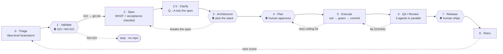

# solo-sdlc

A gated 9-phase SDLC for **one founder shipping with AI**.

Most AI coding workflows optimize the wrong bottleneck. When you're solo, the expensive failure isn't slow typing — it's spending three weeks building something nobody wanted, or letting an agent grind on a broken plan until it has wrecked your codebase. This plugin puts gates where those failures happen.

Three ideas do most of the work:

- **Validate the business case before the repo exists.** A repo is the artifact of deciding to *build*, not of deciding *whether* to build. Phases 0–1 run in a scratch directory; `git init` happens only after you say GO.
- **The author never grades their own work.** Every review is a separate agent with fresh context — the session that wrote the plan cannot be the one that approves it.
- **Execution has a ceiling.** An agent gets 3 attempts at the same failure and 5 at a task. Then it reverts to the last green commit and reports, instead of looping until your budget and your architecture are both gone.

## Install

```
/plugin marketplace add ltlongtma/solo-sdlc
/plugin install solo-sdlc@solo-sdlc
```

## Use it

```
/solo-sdlc:start      I want to build a tool that ...   # full pipeline, from anywhere
/solo-sdlc:validate   <a rough idea>                    # phase 1 only — is this worth building?
/solo-sdlc:architect                                    # phase 3 only — stack options + trade-offs
/solo-sdlc:gate                                          # phase 6 only — the QA/review gate
/solo-sdlc:converge                                      # reconcile real code against spec + plan
```

The `sdlc` skill also auto-triggers on things like *"take this idea to production"* or *"resume this project properly"*. A vague idea is a fine starting point — phase 0 exists to sharpen it.

## The pipeline



| # | Phase | Artifact | Gate |
|---|---|---|---|
| 0 | Triage / Idea | `docs/backlog.md` | Worth doing? which track? |
| 1 | Validate | `docs/business/<idea>-validation.md` | **GO / NO-GO ⛔** |
| 2 | Spec | `docs/specs/<feature>.md` + acceptance checklist | Spec agreed |
| 2.5 | Clarify | Clarifications section in the spec | Nothing ambiguous blocks the plan |
| 3 | Architecture | ADRs + `docs/design/architecture.html` | **Stack chosen ⛔** |
| 4 | Plan | `docs/plans/YYYY-MM-DD-*.md` + verified research + task status | **Plan approved ⛔** |
| 5 | Execute | code on `feat/*`, one commit per task | Every task green |
| 6 | QA / Review | PR + review notes | CI green, checklist passes, no CRITICAL/HIGH |
| 7 | Release | tag + `docs/releases/*` + `docs/runbook.md` | **Human ships ⛔** |
| 8 | Retro | `docs/retro/*` | Lessons written down |

Phases scale to the work through four rigor tracks: **trivial** (skip 1–4), **feature** (skip validate), **high-risk** (architecture + security required, two review rounds), **new product** (all nine).

There's an interactive version of this diagram in [`docs/workflow-diagram.html`](docs/workflow-diagram.html) — open it locally to click through each phase and highlight the path a given track takes.

## The agents

| Agent | Runs at | Mandate |
|---|---|---|
| `product-critic` | phase 1 | Kill bad ideas cheaply. Market, competitors, unit economics, distribution, risk. Every claim cited; every fatal assumption gets the cheapest possible test. |
| `solution-architect` | phase 3 | Propose 2–3 stacks with real monthly costs and escape routes. Optimizes for *"can one person fix this at 2am?"* Proposes — never approves. |
| `tech-lead-reviewer` | phases 4 & 6 | Assume the document is broken and find out how. Dependency order, interface drift, oversized tasks, requirement→task coverage matrix. |
| `qa-breaker` | phase 6 | Break it before a user does. Edge cases, boundaries, replay, cross-account access, error paths. A bug without a repro doesn't count. |
| `security-reviewer` | phase 6, conditional | Attacker's lens: secrets, IDOR, injection, SSRF, webhook replay, dependency CVEs. CRITICAL/HIGH block the merge. |

All of them report and never edit — fixing belongs to the main session.

## Design decisions worth knowing about

**Task granularity is a gate, not a suggestion.** Oversized tasks are the number-one reason subagents fail. A task ships only if it has one red→green test, is committable on its own with the repo still green, can be done by a fresh-context agent from the plan plus 1–3 named files, and depends on nothing unfinished.

**Task status lives in git.** Agent scratch ledgers are git-ignored and vanish. So the plan file carries `- [x] Task 3 — <name> — <commit hash>`, ticked the moment the task goes green. A ticked box with no hash counts as not done.

**The pipeline loops.** Architecture that breaks the spec goes back to the spec. A retry ceiling means the plan was wrong, not that the agent needs more attempts. Every backward step that changes a settled artifact gets an ADR.

**"Brainstorm" is disambiguated.** Idea-level (phase 0), solution-level (phase 2), and technical (phase 3) are different conversations. Discussing libraries while defining requirements means you're in the wrong phase.

## Optional integrations

Everything works standalone. When these are installed, the skill and agents use them as a baseline layer and keep going:

- [`superpowers`](https://github.com/obra/superpowers) — `brainstorming`, `writing-plans`, `subagent-driven-development`, `test-driven-development`, `using-git-worktrees`. The strongest pairing; solo-sdlc supplies the business gates and review agents that sit around it.
- [`plannotator/effective-html`](https://github.com/plannotator/effective-html) — `/html-diagram` for the living architecture diagram.
- `minimalist-entrepreneur` — pricing, first customers, and marketing frameworks at phases 1 and 7.
- gstack — `/qa`, `/browse`, `/review`, `/ship`, `/cso`, `/retro`.
- Trail of Bits `skills` — security plugins used by `security-reviewer` on large PRs.
- MCP servers for code graphs and library docs (e.g. context7) — used to verify claims instead of trusting recall.

## How this relates to Spec Kit

[GitHub Spec Kit](https://github.com/github/spec-kit) solves an adjacent problem: it standardizes spec-driven artifacts across any agent, through a CLI and command set (`specify`, `plan`, `tasks`, `clarify`, `analyze`, `checklist`, `converge`). solo-sdlc borrows several of its ideas — acceptance checklists as "unit tests for prose", clarifications committed into the spec rather than left in chat, an explicit requirement→task matrix, and reconciling real code against the spec when resuming.

It deliberately does **not** wrap the Spec Kit CLI. This plugin keeps its artifacts in plain `docs/` and adds what a solo founder needs and a spec toolkit doesn't cover: business validation before the repo, adversarial review agents, an execution retry ceiling, an incident runbook, and human gates on value decisions. If you already run Spec Kit, take the agents from here and ignore the pipeline.

## Contributing

Issues and PRs welcome — see [CONTRIBUTING.md](CONTRIBUTING.md). The most useful contribution is a real session where the process failed you: which phase, what the agent did, what you expected. Process rules are behavior-shaping prompts, so changes need evidence from actual use, not just a tidier wording.

## License

MIT — see [LICENSE](LICENSE).
